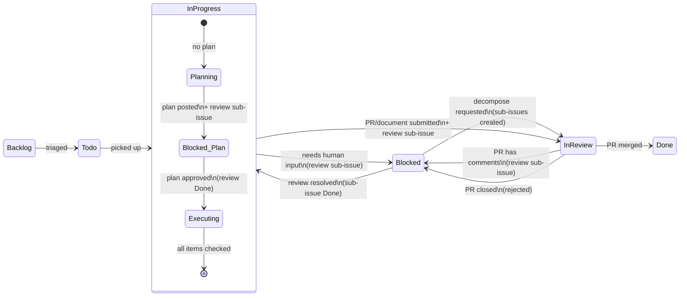

# taskmanager-agent

A Claude Code plugin for autonomous task management. Integrates with Linear to pull issues, plan work with human-in-the-loop review, execute via git worktrees and pull requests (or documents), and keep issue statuses in sync — in both interactive and daemon mode.

## How It Works

The plugin operates in two modes:

- **Interactive** — You run slash commands (`/tm-next`, `/tm-assign`, etc.) inside Claude Code. Claude works through issues one at a time with your confirmation.
- **Daemon** — A background process (`tm_daemon.py`) continuously polls for work, spawns Claude Code sessions, tracks metrics, and manages the full lifecycle autonomously.

Both modes follow the same issue lifecycle:



A separate **conversation workflow** handles projectless issues — back-and-forth discussions that don't follow the plan/execute/PR pattern.

### The Issue Lifecycle

The process flow routes every issue based on its current status:

**Route C — Planning** (Todo or In Progress without a plan) — Claude analyzes the issue, explores the codebase (for code tasks), and posts a checklist-style execution plan as a comment. A review sub-issue is created and assigned to the human reviewer. The parent issue is set to Blocked until the plan is approved.

**Route D — Execution** (In Progress with an approved plan) — Claude works through each unchecked plan item. For code tasks, work happens in an isolated git worktree. Each completed item is checked off in the plan comment. On completion, a PR is created and the issue moves to In Review with a review sub-issue for PR review.

**Route A — PR Review** (In Review) — Checks the PR status. Merged → closes the issue and all sub-issues. Has review comments → creates a review sub-issue and blocks the parent for human triage. Open with no comments → no action (still under review). Closed without merge → marks the issue Blocked.

**Route B — Unblock** (Blocked) — Checks for resolved review sub-issues (marked Done). If found, reads the reviewer's response, unblocks the parent to In Progress, and resumes work with the response as context. If the response requests decomposition, routes to Route F instead.

**Route E — Wrap Up** (In Progress, all plan items checked) — Moves the issue to In Review. This handles the edge case where all work was completed but the status wasn't updated.

**Route F — Decompose** (triggered from Route B) — Splits a large plan into individual sub-issues with dependency chains. The parent becomes a tracking umbrella in In Review.

### When Things Go Wrong

Not every session succeeds. The daemon detects failures and quarantines issues so they don't block the pipeline.

**What triggers quarantine:**

| Failure Mode | Detection | Example |
|---|---|---|
| **Timeout** | Session exceeds the timeout (default 2.5 hours) | Claude gets stuck in a loop or the task is too large |
| **Unchanged state** | Issue status is the same before and after the session | Claude ran but made no meaningful progress |
| **Invalid transition** | Issue moved to a status that isn't valid for its starting state | `Todo → Done` (skips the plan/execute workflow) |
| **Missing artifacts** | Valid transition but required artifacts don't exist | `In Progress → In Review` without a PR |

**What happens when an issue is quarantined:**

1. A **Bug sub-issue** is created under the parent, labeled "Bug", assigned to the human reviewer. Its description contains the failure reason and instructions.
2. The parent issue is set to **Blocked**.
3. The quarantined issue ID is added to `~/.claude/taskmanager/daemon-state.yaml` — the daemon skips it during polling.
4. Session metrics (cost, tokens, duration, outcome) are recorded to the SQLite database.

**Recovery paths:**

- **Self-healing bug triage (Phase 1.5)** — Comment on the Bug sub-issue with guidance ("the repo needs X first", "try without the Y flag"). The daemon detects the new comment, removes the parent from quarantine, and spawns a new session with your guidance as context. If the retry succeeds, the Bug sub-issue is closed automatically.
- **Manual state reset** — Edit `~/.claude/taskmanager/daemon-state.yaml` to remove the issue from the quarantine list, then use `/tm-update` or `/tm-assign` to re-queue it.

### Human Operator Guide

Every intervention point follows the same pattern: Claude creates a trackable sub-issue, the human acts on it, and the daemon resumes automatically.

| When | What You See | What To Do | What Happens Next |
|---|---|---|---|
| **Plan approval** | Review sub-issue linking to a plan comment on the parent issue | Read the plan. Comment on the review sub-issue if changes are needed, then mark it Done. | Parent unblocks, Claude executes the plan. |
| **Blocked during work** | Review sub-issue with a question from Claude | Answer the question on the review sub-issue, then mark it Done. | Claude resumes execution with your answer as context. |
| **PR review** | Issue in "In Review" with a PR link | Review the PR on Forgejo/GitHub. Merge if good, or add comments for changes. | Merged: issue auto-closes. Comments: review sub-issue created, parent blocked until triaged. |
| **Quarantine triage** | Bug sub-issue with a daemon error message; parent Blocked | Read the error. Comment on the Bug sub-issue with guidance for retry. | Daemon detects your comment, removes quarantine, retries with your guidance. Closes Bug sub-issue on success. |
| **Decomposition** | Review sub-issue suggesting the plan is large (8+ items) | Comment "decompose" on the review sub-issue if you want the plan split, then mark Done. Or just mark Done to proceed as-is. | If decomposed: plan is split into sub-issues with dependency chains. Otherwise: single execution. |
| **Conversation** | Projectless issue with `**[Conversation]**` comments | Comment on the issue with your request or response. | Claude reads your comment and takes the next action (create project, create issues, research, respond, or close). |

> **Tip:** You never need to manually change issue statuses. All transitions are handled by the daemon or Claude sessions. Your only actions are: read, comment, mark review sub-issues as Done, and merge PRs.

## Prerequisites

- Python 3.12+
- [uv](https://docs.astral.sh/uv/) for dependency management
- A [Linear](https://linear.app) account with an API token
- Git (for code tasks)

## Setup

1. **Set your API tokens** — either export them or copy `.env.example` to `.env`:
   ```bash
   cp .env.example .env
   # Edit .env and fill in your values
   ```
   Or export directly:
   ```bash
   export TASKMANAGER_AGENT_LINEAR_TOKEN="lin_api_..."
   export TASKMANAGER_AGENT_FORGEJO_TOKEN="your_forgejo_token"
   export TASKMANAGER_AGENT_FORGEJO_URL="https://forgejo.example.com"
   ```

2. **Install the plugin** — add it to your Claude Code plugins or clone locally.

3. **Run the health check:**
   ```
   /tm-health
   ```

This bootstraps everything:
- Creates the Python virtual environment and installs dependencies
- Verifies Linear API connectivity
- Discovers your team (or asks you to choose if multiple exist)
- Creates required workflow statuses: Backlog, Todo, In Progress, In Review, Done, Blocked
- Creates required labels: **Claude** (marks issues claimed by Claude), **Review** (marks human-review sub-issues), **Claude Active** (marks projects Claude is allowed to work on)
- Discovers projects tagged with "Claude Active" and validates git repo access
- Cleans up merged worktrees
- Detects stale issues (no activity in 72+ hours by default)
- Writes config to `~/.claude/taskmanager.yaml`

> Run `/tm-health` again any time to repair or refresh the environment. It is idempotent.

4. **Tag your projects** — In Linear, add the "Claude Active" label to any project you want Claude to work on. Only tagged projects are visible to the plugin.

5. **Set local paths** — For code projects, ensure `local_path` is set in `~/.claude/taskmanager.yaml` to point at your local clone. `/tm-health` will auto-detect repos in common locations, but you may need to set this manually.

## Picking Up Work

### Smart Selection (`/tm-next`)

`/tm-next` selects the next issue to work on using a 6-phase priority system:

| Phase | What it checks | Action |
|-------|---------------|--------|
| 1. In Review | PRs for issues Claude submitted | Merged → close issue. Has comments → create review sub-issue. Closed → mark blocked. |
| 1.5. Bug Triage | Quarantined issues with new human comments on Bug sub-issues | Remove from quarantine, retry with human guidance as context. |
| 2. Resolved Reviews | Review sub-issues marked Done | Unblock the parent issue, resume work with reviewer's feedback. |
| 3. In Progress | Issues Claude already started | Resume where it left off (plan or execute). |
| 4. Todo Backlog | Unblocked Todo issues by priority | Urgent → High → Normal → Low. Skips blocked issues. |
| 5. Conversations | Projectless issues with new comments | Process via the conversation workflow. |

In interactive mode (default), you confirm before work begins. Use `/tm-next --project "My Project"` to filter to a specific project.

### Direct Assignment (`/tm-assign <id>`)

Point Claude at a specific issue. It determines the next action automatically: plan if no plan exists, execute if a plan is ready, or converse if it's a projectless issue.

### Conversation Issues (`/tm-converse <id>`)

Process a projectless issue through a comment-based back-and-forth. Instead of plan/execute/PR, Claude reads the issue description and comments, determines the appropriate action, and posts a response.

Actions Claude can take in conversation mode:
- **create-project** — Set up a new project (Linear project + code repo)
- **create-issues** — Create issues in an existing project
- **research** — Analyze code, answer questions, explore
- **respond** — Ask clarifying questions or provide information
- **close** — Mark the conversation complete

Conversation responses are tagged with `**[Conversation]**` to distinguish them from activity comments.

### Autonomous Processing (`/tm-work-backlog`)

Loops through the entire Todo backlog: select → plan → execute → repeat. Pauses for confirmation every 3 issues.

```
/tm-work-backlog                        # process all active projects
/tm-work-backlog --project "My App"     # limit to one project
/tm-work-backlog --limit 5              # stop after 5 issues
```

### Daemon Mode (`tm_daemon.py`)

Run the task manager as a background daemon that continuously polls for work and spawns Claude Code sessions to process issues.

```bash
python scripts/tm_daemon.py [OPTIONS]
```

| Flag | Default | Description |
|------|---------|-------------|
| `--poll-interval` | `10` | Initial poll interval in seconds |
| `--timeout` | `9000` (2.5h) | Session timeout in seconds |
| `--no-daemon-log` | off | Disable the daemon log file |
| `--no-session-log` | off | Disable per-session log files |
| `--no-session-output` | off | Disable Claude session output capture |

**How it works:**

1. Loads state from `~/.claude/taskmanager/daemon-state.yaml` and acquires a PID lock (refuses to start if another instance is running).
2. Polls for work using the same 6-phase selection as `/tm-next`.
3. Spawns a Claude Code session (`claude --print` with `--output-format stream-json`) for the selected issue.
4. Posts progress comments on the issue during the session (every 5 minutes or on checklist ticks).
5. On completion, validates that the issue transitioned correctly and required artifacts exist.
6. Records session metrics (cost, tokens, duration) to the SQLite database.
7. If the session failed validation, the issue is quarantined.

**Progress Comments:**

During long-running sessions, the daemon posts `**[Progress]**` comments on the issue showing elapsed time, recent activity snippets, and tool usage counts. Comments are triggered every 5 minutes or when a checklist item is checked off.

**Workflow Validation:**

After each session, the daemon validates that the issue transitioned through a valid path and that required artifacts exist:

| Transition | Required Artifacts |
|------------|-------------------|
| Todo → In Progress | Plan comment + review sub-issue |
| Todo → In Review | Plan comment + review sub-issue + PR |
| In Progress → In Review | PR (branch pushed) |
| In Progress → Blocked | Review sub-issue |

Invalid transitions or missing artifacts result in quarantine with a descriptive outcome (`invalid_transition`, `missing_artifacts`, `unchanged`, `timeout`).

**Session Metrics Database:**

Every session is recorded in `~/.claude/taskmanager/sessions.db` (SQLite):

- **sessions** — issue, project, outcome, duration, API cost, token counts, turns
- **pull_requests** — links sessions to PRs they created

Use `tm_session_report.py` to query this data (see [Session Reports](#session-reports)).

**Adaptive Polling:**

The daemon backs off when idle and resets when work is found:

| Tier | Interval | Duration |
|------|----------|----------|
| 0 | 10s | 10 min |
| 1 | 30s | 10 min |
| 2 | 2 min | 10 min |
| 3 | 5 min | 10 min |
| 4 | 15 min | permanent |

**Quarantine:** If a session times out, completes without changing the issue state, or fails validation, the issue is quarantined — a Bug sub-issue is created and the parent is blocked. The daemon's Phase 1.5 (bug triage) enables self-healing: comment on the Bug sub-issue with guidance, and the daemon will automatically retry. See [When Things Go Wrong](#when-things-go-wrong) for full details on triggers, recovery paths, and the [Human Operator Guide](#human-operator-guide) for what to do at each step.

**Shutdown:** Two-stage signal handling — the first SIGINT/SIGTERM enters drain mode (finishes the active session, then exits). A second signal while draining force-kills the active session and exits immediately.

## Session Reports

Query the session metrics database for cost tracking, performance analysis, and audit trails.

```bash
python scripts/tm_session_report.py [OPTIONS]
```

| Flag | Description |
|------|-------------|
| `--project <name>` | Filter sessions by project name |
| `--issue <id>` | Filter by issue identifier (e.g., `LAN-42`) |
| `--since <date>` | Only sessions after this date (ISO 8601) |
| `--format {table,csv,json}` | Output format (default: `table`) |

**Output formats:**

- **table** — Rich terminal tables with color-coded outcomes. Shows summary stats (total sessions, unique issues, cost, tokens, average duration), a sessions table, PRs table, and per-issue breakdown.
- **csv** — Flat CSV with all session columns, suitable for spreadsheets.
- **json** — Structured JSON with `summary`, `sessions`, and `pull_requests` keys.

**Examples:**

```bash
# All sessions from the last week
python scripts/tm_session_report.py --since 2026-03-15

# Cost breakdown for a specific project
python scripts/tm_session_report.py --project "Task Manager Agent" --format table

# Export all data as JSON for external analysis
python scripts/tm_session_report.py --format json > sessions.json
```

## Commands

| Command | Description |
|---------|-------------|
| `/tm-health` | Setup and validate the environment. Run first, re-run to repair. |
| `/tm-next` | Pull the next work item using smart 6-phase selection. |
| `/tm-assign <id>` | Assign a specific issue to Claude and begin working on it. |
| `/tm-plan <id>` | Create an execution plan for an issue (posts checklist, creates review sub-issue, blocks until approved). |
| `/tm-work <id>` | Execute the approved plan (git worktree + PR for code, documents for non-code). |
| `/tm-converse <id>` | Process a conversation issue — read comments, determine action, respond. |
| `/tm-update <id> <status>` | Manually update an issue's status with an optional comment. |
| `/tm-issues` | List issues from active projects. Defaults to Todo and Backlog. Filter with `--project` or `--status`. Use `--conversation` for projectless issues. |
| `/tm-issue-create` | Create a new issue in an active project, or a projectless conversation issue. |
| `/tm-project-create` | Create a new project and mark it as active. Optionally attach a git repo URL. |
| `/tm-work-backlog` | Process the backlog autonomously with checkpoints every 3 issues. |

**Standalone scripts:**

| Script | Description |
|--------|-------------|
| `scripts/tm_daemon.py` | Run the daemon (see [Daemon Mode](#daemon-mode-tm_daemonpy)). |
| `scripts/tm_session_report.py` | Query session metrics (see [Session Reports](#session-reports)). |

## Code Mode vs Document Mode

The plugin automatically determines the mode based on the project configuration:

- **Code mode** — Project has a `repo` URL. Work happens in a git worktree (`git worktree add`). On completion, changes are committed, pushed, and a PR is created and linked on the issue.
- **Document mode** — Project has no repo. Work produces Linear documents. On completion, documents are linked and the issue moves to In Review.

## Git Hosting Abstraction

PR creation and status checks go through a `GitHostBackend` protocol in `taskmanager/githost/`, making the plugin independent of any single git hosting platform.

**Current backends:**
- **Forgejo/Gitea** — fully implemented. Authenticates via `TASKMANAGER_AGENT_FORGEJO_TOKEN`.

**Platform detection:** `detect_platform(repo_url)` inspects the hostname — `github.com` maps to `"github"`, everything else defaults to `"forgejo"`. The factory function `get_githost_backend()` returns the matching backend instance.

**URL parsing:** `parse_repo_url()` extracts `(owner, repo)` from HTTPS, SSH (`ssh://`), and short SSH (`git@host:path`) URLs. `repo_url_to_https_base()` converts any format to an HTTPS base URL for API calls.

**Adding a new backend:**

1. Create a new file in `taskmanager/githost/` (e.g., `github.py`).
2. Implement the `GitHostBackend` protocol — two methods: `create_pr()` and `check_pr_status()`.
3. Add the hostname pattern to `detect_platform()` in `base.py`.
4. Register the new class in `get_githost_backend()` in `__init__.py`.

## Environment Variables

| Variable | Required | Description |
|----------|----------|-------------|
| `TASKMANAGER_AGENT_LINEAR_TOKEN` | Yes | Linear API token for reading/writing issues, comments, and projects |
| `TASKMANAGER_AGENT_FORGEJO_TOKEN` | For Forgejo PRs | Forgejo/Gitea API token for creating pull requests |
| `TASKMANAGER_AGENT_FORGEJO_URL` | For repo creation | Forgejo/Gitea base URL (e.g. `https://forgejo.example.com`) |

All variables can be set in a `.env` file at the project root (see `.env.example`). The agent loads `.env` automatically via `python-dotenv`.

**Daemon git identity:** Sessions spawned by the daemon use a fixed git identity — `Claude Daemon <claude-daemon@local>` — set via `GIT_AUTHOR_NAME`, `GIT_COMMITTER_NAME`, `GIT_AUTHOR_EMAIL`, and `GIT_COMMITTER_EMAIL` in the session subprocess.

**Daemon state file:** `~/.claude/taskmanager/daemon-state.yaml` — stores PID lock, quarantine list, and session history. Managed automatically by the daemon.

**Daemon metrics database:** `~/.claude/taskmanager/sessions.db` — SQLite database recording session metrics and PR history. Managed by the daemon, queried via `tm_session_report.py`.

## Config File

`/tm-health` writes and maintains `~/.claude/taskmanager.yaml`:

```yaml
backend: linear
last_health_check: "2026-03-19T14:30:00Z"

operator:
  id: <user-id>
  name: <user-name>

team:
  id: <team-id>
  name: <team-name>

statuses:
  backlog: <id>
  todo: <id>
  in_progress: <id>
  in_review: <id>
  done: <id>
  blocked: <id>

labels:
  issue:
    claude: <id>
    review: <id>
  project:
    claude_active: <id>

projects:
  - id: <project-id>
    name: My Code Project
    repo: https://github.com/user/repo.git
    local_path: /home/user/code/repo      # set this for code projects
    git_accessible: true
  - id: <project-id>
    name: Documentation Project
    repo: null                             # document-only project
    local_path: null

stale_threshold_hours: 72

issue_defaults:                          # optional
  assignee_id: <user-id>                 # default assignee for new issues
  assignee_name: Gabriel Lawrence        # display name (informational)
```

### Default Assignee

By default, issues created by `/tm-issue-create` and review sub-issues from `/tm-plan` are assigned to the issue creator (the Linear API token owner). To assign them to a different user:

- **Per-issue:** Use `--assignee "Display Name"` or `--assignee <uuid>` with `/tm-issue-create`.
- **Globally:** Add `issue_defaults.assignee_id` and `issue_defaults.assignee_name` to the config file. All new issues and review sub-issues will use this default unless overridden with `--assignee`.

## Architecture

```
commands/           Slash commands (markdown with YAML frontmatter)
references/         Shared workflow logic referenced by commands
scripts/            Python CLI scripts (thin wrappers over the backend)
  tm_daemon.py        Daemon entrypoint
  tm_session_report.py  Session metrics reporting
taskmanager/        Core Python package
  config.py           Config file management
  models.py           Data classes (Issue, Project, Status, Label, etc.)
  backends/           Task tracker backends
    base.py             TaskBackend protocol (interface)
    linear.py           Linear GraphQL implementation
  daemon/             Daemon mode subsystem
    runner.py           Main daemon loop and signal handling
    session.py          Claude Code session spawning
    poller.py           Adaptive polling with backoff tiers
    selector.py         Issue selection (6-phase priority)
    progress.py         Progress comment posting during sessions
    database.py         SQLite session metrics and PR tracking
    validator.py        Workflow transition and artifact validation
    state.py            Daemon state persistence and quarantine
    logging_config.py   Log file configuration
  githost/            Git hosting backends
    base.py             GitHostBackend protocol and URL parsing
    forgejo.py          Forgejo/Gitea implementation
tests/              pytest test suite
```

The plugin is backend-agnostic at two levels:
- **Task tracking** — all issue operations go through the `TaskBackend` protocol in `taskmanager/backends/`. To add Jira, GitHub Issues, or another tracker, implement the protocol there.
- **Git hosting** — PR creation and status checks go through the `GitHostBackend` protocol in `taskmanager/githost/`. See [Git Hosting Abstraction](#git-hosting-abstraction) for details.

## License

MIT
